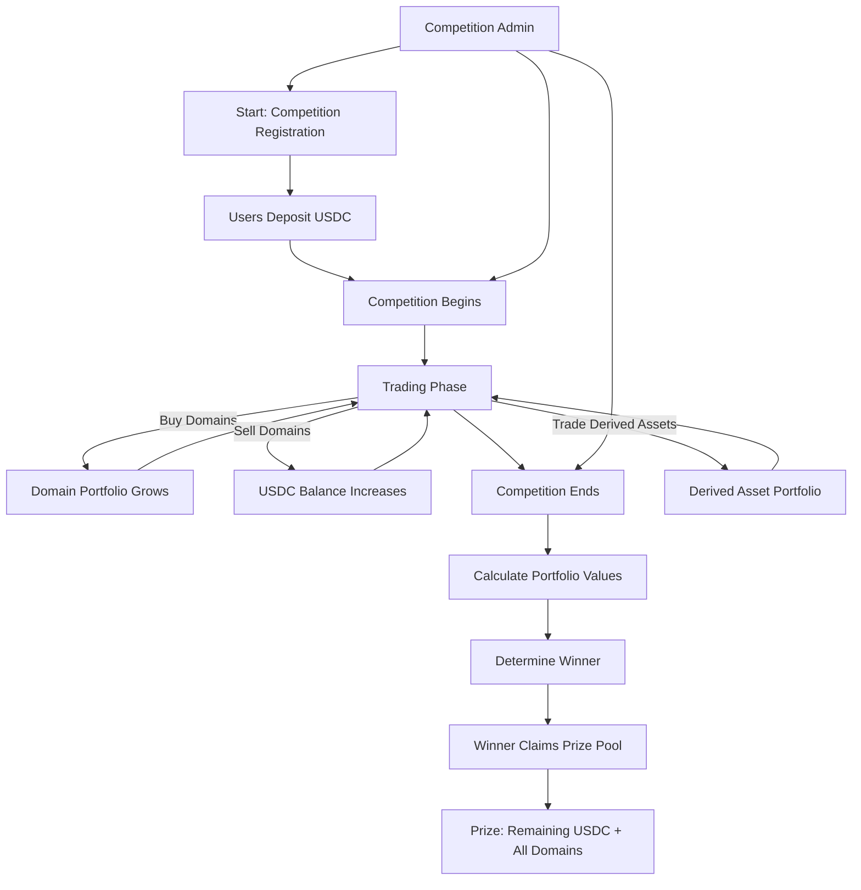

# Domain Trading Competitions

# 🎯 Why?

---

Domain traders typically operate large portfolios that range from 10K domains to over 1M+ domains. These portfolios provide a high yield outperforming most major asset classes. 

Despite that running a Domain investment portfolio (like a Domain ETF) remains challenging. 

## 🧗‍♀️Challenges

- **Discover the best traders**: It is hard to find the best traders, and/or trading strategies.
- **Lack of Transparency**: Domain investment, use of funds, returns etc remain a black box undermining investor confidence.
- **Hard to get started**: Most domain traders spend a lot of time ramping up their portfolio due to ineffective cash strategies.

# 👩‍💻 Customer Profile

---

The customer profile is active domain traders out there. Nearly 40-60% of all domains are held by active traders, who use different strategies to buy and sell names or other strategies to monetize domains.

<aside>
ℹ️

An interface that enables web2 users to trade, will bring in a whole set of new users from the traditional domain industry

</aside>

# 🗺️ User Journey

---

## 🏆 User Flow

## 🏗️ Deep Dive

The trading interface should be fully programmed on-chain. Some key interfaces needed:

- Ability to do domain trading from using on chain actions.
    - The pool owner can sign transactions, but all the assets are owned by the contract.
    - Contracts whitelist what operations can be done, and provide out of the box ways to do sales, listing and derived asset creation/trading
- Valuation of the portfolio will be tricky. There are a few domain oracles that can be used, but it will be better to use heuristics in addition to pure oracles
    - Allow simple things, like highest outstanding orders to calculate final pool price

## 📊 Growth

These competitions can be rolled into an automated ETF backed by domains. The competition winners can start their own investment portfolios allowing users to tap into domain assets, while enabling investors to raise funds for investing.

## 🌐 Doma Advantage

---

Doma enables all operations to be conducted on-chain. This allows for a fully automated domain trading desk to be built on-chain, while offering seamless data integrations as well.